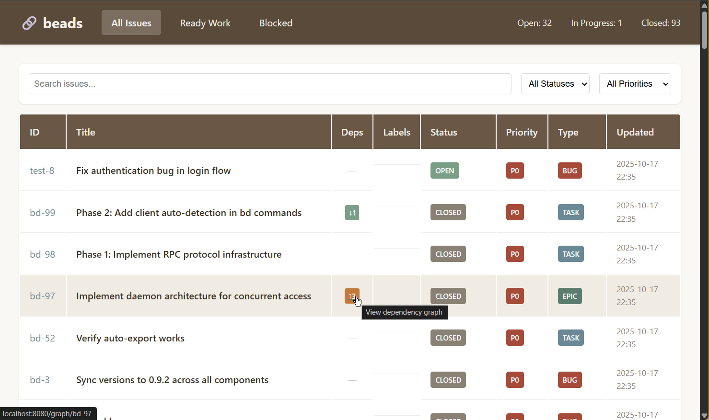
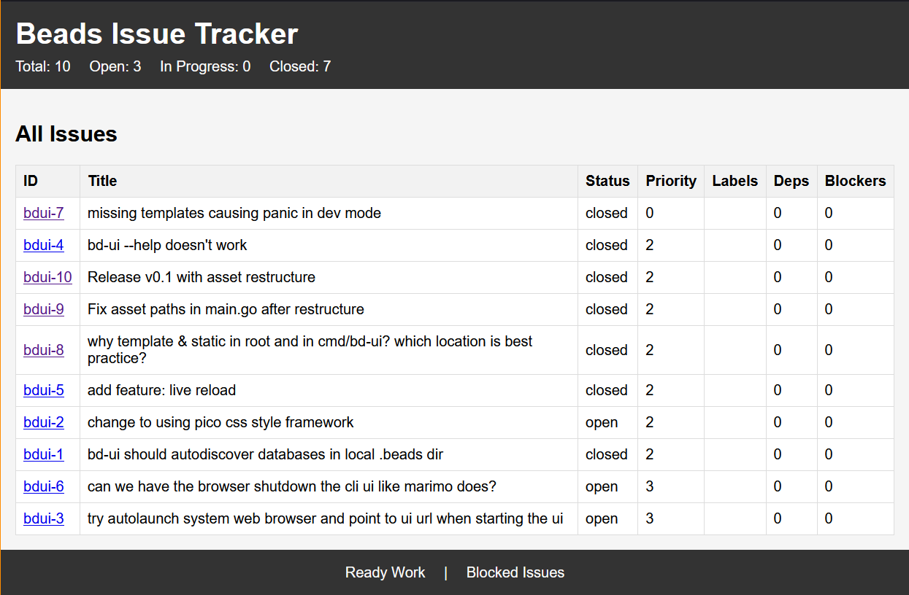
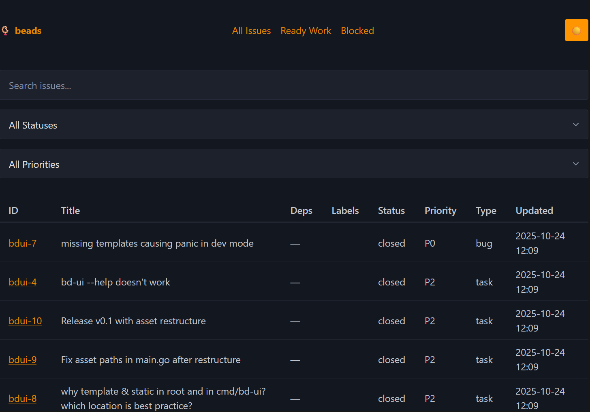
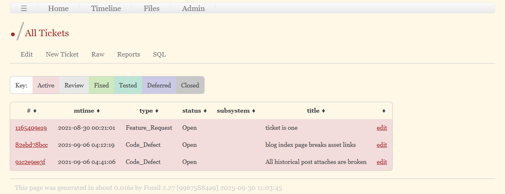
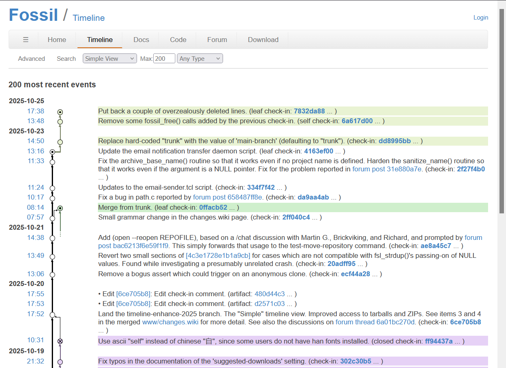

# ideas

*A loose collection of ideas, examples, and inspirations from hich we might pull into Beads-ui project.*

## bd-ui v0

The 1st ui, built by Ampcode [Feature/web UI (DRAFT) by maphew · Pull Request #77 · steveyegge/beads · GitHub](https://github.com/steveyegge/beads/pull/77). 

Likes:

- search, status and priority filters
- general feel, colour scheme is not bad

Missing:

- I want to use a light weight css framework with variables instead of direct styles. Probably Pico-css.
- no dark mode

## bd-ui v0.1

Another amp code UI. Built automatically when reorganizing the code layout and it lost track of the previous templates and styles.

Likes:

- has better information density than others so far

Missing:

- filtering, sorting, searching

## bd-ui pico

First attempt at using Pico CSS framework.

Likes:
- integrated dark & light modes
- colour themes
- Lightweight
- Easy to customize with CSS variables

Missing:

- Info density is weak, poor use of whitespace (too much of it)

## Fossil SCM

### Tickets

Likes:
- can sort on any column
- edit link on each row
- colour coded status
- sub-pages: 
  - create new ticket
  - raw view - a plain text table of tickets in this filter state, easy to copy paste

### Timeline view (commit and branch history)

Likes:
- graph viz
- easy date navigation
- commit message preview

